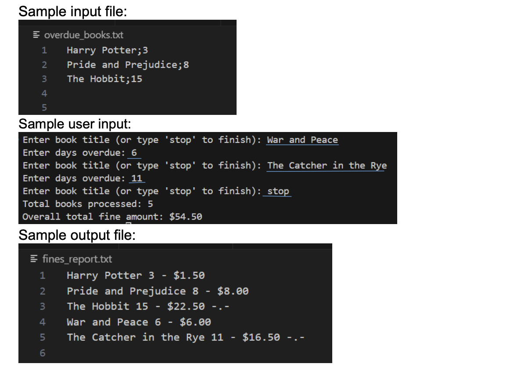

# The Local Librarian 📚
The local librarian, Mr. Sleepy would like to keep track of overdue books in the library. He
needs a Python program to help him manage overdue book returns.

## Task
The program should read the overdue book data from a file named `overdue_books.txt`.
Each line contains a book title and the number of days overdue separated by a `;`

Calculate the fine for each book based on one of these rules:
• From 1-5 days overdue, $0.50 per day
• From 6-10 days overdue, $1.00 per day
• More than 10 days overdue, $1.50 per day + a stern librarian glare denoted by `"-.-"`

Use a list to store the book title, overdue days and fine amount.

Allow the librarian to add more overdue books manually using a while loop.
• Prompt the librarian for the title name
• Prompt the librarian for the days overdue.
The loop should stop when he types “stop” instead of a book title.

When the program is stopped, write the results (book title, days overdue and fine) to a new
file name `fines_report.txt`

The program then displays a summary of total books processed and the overall total fine amount.

## Breakdown 
__Test as much each step, convert to appropriate data types__
1. Read a file, do simple print out
2. Read by line, print out
3. Read by line and use a split to separate
4. store each part to the list 
5. do simple if else calculate based on X days overdue, if > 10 days add in emoji also, print amount for each X days
6. now based on the days listed in the file, factor in the if else 
7. prompt n take the user title, test whether can capture the prompt
8. prompt n take days overdue
   - test whether can capture prompt
   - convert to int
9.  do basic prompt, take the prompt and test if "stop".. print stop 
10.  create a while loop and put step 7,8 inside. upgrade step 7 to include the if statement in step 9
11.  add to the list when user keys in 7,8 properly
12.  process the steps n display summary based on the calculation.
13.  upgrade each portion into functions if possible
14.  write basic file
- write file with each line of book details.
- enhance write with seperator and join 

